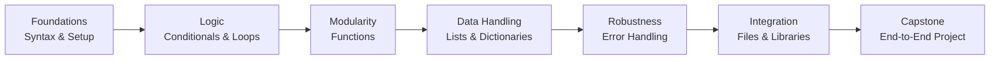

# Python Course: Beginner to Intermediate


## Overview
This repository contains a **14-week Python programming course**, designed to take learners from beginner concepts to unit testing. Each week includes exercises, solutions, and learning objectives. The course culminates in a **Capstone Project** where students apply all concepts learned.

**Skills Covered:**
- Python fundamentals: variables, control flow, functions
- Data structures: lists, tuples, dictionaries, sets
- File I/O, modules, exception handling
- Object-Oriented Programming (OOP)
- Working with external data (JSON, CSV, APIs)
- Unit testing using `unittest`
- Project design and organization

---

## Curriculum Progression Model


---

## Curriculum Mapping (Bloom’s Taxonomy)

| Week | Topic | Folder | Learning Objective | Bloom’s Level |
|------|-------|--------|------------------|---------------|
| 1 | Introduction | [Week-01-Introduction](Week-01-Introduction/) | Understand Python environment, syntax, and program flow | Remember / Understand |
| 2 | Control Flow | [Week-02-Control-Flow](Week-02-Control-Flow/)| Apply conditional logic and loops in programs | Apply |
| 3 | Functions | [Week-03-Functions](Week-03-Functions/) | Design and implement reusable functions | Apply / Create |
| 4 | Data Structures I | [Week-04-Data-Structures-I](Week-04-Data-Structures-I/)| Use lists and tuples to store and manipulate data | Apply |
| 5 | Data Structures II | [Week-05-Data-Structures-II](Week-05-Data-Structures-II/ | Analyze and use dictionaries and sets for problem solving | Analyze |
| 6 | Strings and File I/O | [Week-06-Strings-and-File-IO](Week-06-Strings-and-File-IO/)| Apply string operations and read/write files | Apply |
| 7 | Modules and Packages | [Week-07-Modules-and-Packages](Week-07-Modules-and-Packages/) | Integrate built-in and custom modules | Apply / Analyze |
| 8 | Exception Handling | [Week-08-Exception-Handling](Week-08-Exception-Handling/)| Evaluate and handle errors effectively | Evaluate |
| 9 | OOP I | [Week-09-OOP-I](Week-09-OOP-I/) | Understand and implement basic classes and objects | Understand / Apply |
| 10 | OOP II | [Week-10-OOP-II](Week-10-OOP-II/) | Design and implement object-oriented programs | Apply / Create |
| 11 | Working with External Data |[Week-11-External-Data](Week-11-External-Data/) | Integrate external data sources into applications | Apply / Analyze |
| 12 | Introduction to Testing | [Week-12-Introduction-to-Testing](Week-12-Introduction-to-Testing/) | Understand testing concepts and importance | Understand |
| 13 | Unit Testing | [Week-13-Unit-Testing](Week-13-Unit-Testing/) | Apply unit testing to validate code correctness | Apply / Evaluate |
| 14 | **Capstone Project** |  [Week-14-Capstone-Project](Week-14-Capstone-Project/) | Synthesize skills to build a complete Python application | Create |

---


## Capstone Project: Student Grade Tracker
The final project allows learners to **apply all Python concepts** in a practical scenario.

**Features:**
- Add, edit, delete students and grades
- Calculate averages and top performers
- Save data to CSV or JSON
- Unit tests for key functions

**Folder Structure:**
- `src/` → Python source code  
- `tests/` → Unit tests using `unittest`  
- `data/` → Sample CSV/JSON files  

---

## How to Use This Repository
1. Clone the repo:
   ```bash
   git clone https://github.com/yourusername/python-course-beginner-to-intermediate.git
   ```
   
2. Navigate into the folder:
   ```bash
   cd python-course-beginner-to-intermediate
   ```
   
3. Open the weekly folders for exercises and solutions.

4. Follow the Project instructions in Week-14.


